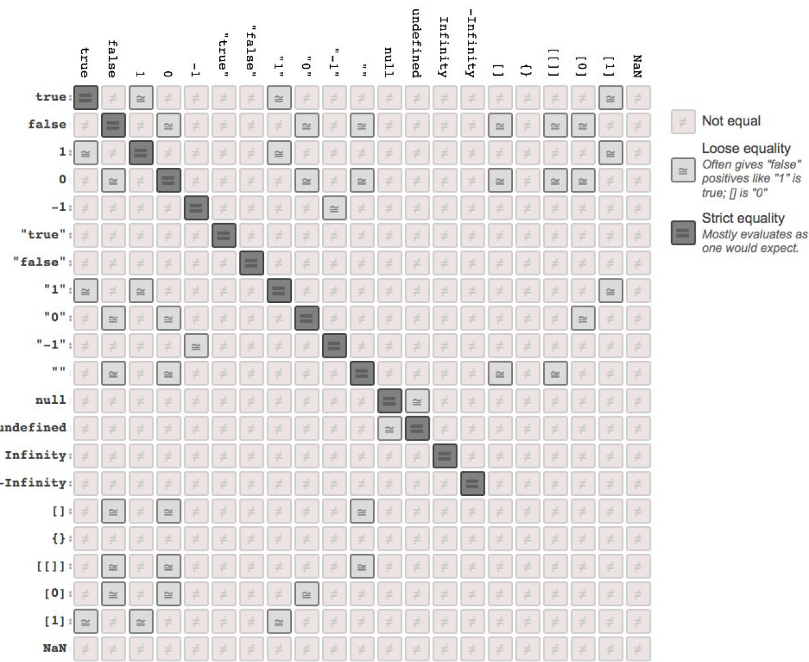

Js de C nin aksine değişkenler değişken türleri ile belirtilmez. 

```javascript
const name = "ismail"
const age = 22
```

Js `dynamic typed` bir dildir. Yani bir değişkenin type ı sonradan değiştirilebilir.
```js
const x = 43
const x = "telefon"
```

Hatta bir listede bile farklı typelar kullanılabilir.

```js
const list = [
    "ismail",
    22,
    function() {console.log("hi")}
]

list[2]() #methodu çalıştırma
```

There are 2 types of variables in js: 
- Primitive types (no methods, immutable)
    - undefined
    - null
    - boolean
    - number
    - string
    - (symbol)
- Objects (primitive harici geri kalan her şey object dir)

Primitive types are immutable means that whenever you try to immute them you actually replace a new one. stored by value.
However objects are mutable, since they are referance types you can change the value without changing the pointer adress looking to it. stored by reference.


### Typecasting
Bir değişkenin type'ı değişebilir dediğimiz gibi.
Bunu farklı şekillerde, gerek implicit gerek explicit olarak yapaibiliriz.

```js
const x = 42
```
bu değişkeni string e çevirmek istiyoruz diyelim.

```js
const explicit = String(x)
const implicit = "" + x
```

### == vs ===
== coerces the type

=== requires equivalent types

We say, never use == since you need to know all the type coercions :



### How to create object
```js
    const obj = new Object()

    obj.name = "İsmail"
    obj.surname = "Çakmak"
    obj.isTeaching = true
    obj.greet = function () {
        console.log("hi")
    }
```

```js
    const obj = {}

    obj.name = "İsmail"
    obj.surname = "Çakmak"
    obj.isTeaching = true
    obj.greet = function () {
        console.log("hi")
    }
```


or just in same line

```js
const obj = {
    name: "ismail",
    surname: "çakmak",
    isTeaching: true,
    greet: function() {
        console.log("hi")
    }
}
```

key olarak sayılarda kullanılabilr mi?
evet çünkü her şey stringe cast lenir ve hashlenir.

```js
const obj = {
    name: "ismail",
    surname: "çakmak",
    1: "hey",
}
```

peki objenin attributelarına nasıl erişiriz. Bu iki şekilde erişebiliriz.
dot notation ile veya parantez ile. parantezin içine konulan şey stringe e çevrilir. 
```js
obj.name
obj[name]
obj["name"]
```

obj.1 diyemeyiz çünkü 1 orda bir int olarak algılanır. fakat onu string olarak verebilriz:
```js
obj.1 -> hata
obj[1]
obj["1"]
```

### Copying Object

Bir objeyi kopyalarken deep copy veya shallow copy yapabiliriz.

Örneğin şunlar shallow copy olur :
```javascript
const obj = {
    name: "ismail",
    surname: "cakmak",
    age : 22,
    isTeaching: true
}

//this is a way to copy an object
const obj2 = Object.assign({},o)

//or you can create the same obj again as well
```

but what if we have this kind of an object

```js
const obj = {
    name: "ismail",
    surname: "cakmak",
    age : 22,
    isTeaching: true
    adresses : {
        adres1: "haliliye"
        adres2: "tuzla"
    }
}
```

what if we copy it with the same method?
```js
const obj2 = Object.assign({},obj)
```

şimdi diyelim ki obj nin adresin bir ekleme yaptık, bu duurmda obj2 nin adresinde bir değişiklik bir olmaması lazım değil mi?

```js
obj.address = {
    adres1: "haliliye"
    adres2: "tuzla"
    adres3: "karaköprü"
}
```

fakat gerçekten olmuyor mu?
```js
obj2.address
```
Oluyor. iki objenin de address değişkeni heap te aynı lokasyona bakıyor. Çünkü obje içinde obje olduğunda düz kopyalamak deep copy olmamış oluyor.
Bunun için bir recursive fonksiyon veya hazır library kullanabiliriz.

Eğer tüm valualar object değilse ozmn direk shallow copy yapabiliriz.


Aynı durum value olarak bir list varsa da yaşanırdı, çünkü list de stored by reference.
```js
const obj = {
    name: "ismail",
    surname: "cakmak",
    age : 22,
    isTeaching: true
    adresses : ["haliliye","tuzla","karakopru"]
}
```


### Deep copy function

lets write our deep copy function

```js
//check if any key is object
//if it is, deep copy it. it not shallow copy it

function deepCopy(obj){

    const keys = Object.keys(obj)
    const newObject = {}

    for (let i=0; i<keys.lenght; i++){
        const key = keys[i]
        if (typeof(key) === 'object'){
            newObject[key] = deepCopy(obj[key])
        }
        else{
            newObject[key] = obj[key]
        }
    }

    return newObject //since this is just a reference to heap memory, this can be returned directly 
}
```

### global object

All variables and functions are actually parameters and
methods on the global object
- Browser global object is the `window` object
- Node.js global object is the `global` object


oluştuğurduğumuz her variable bu global objeye ya method ya da parametre olarak eklenir.

örneğin browser console da:
```js
var name = "ismail"
```
yaptıktan sonra, window objesine bakabiliriz:

```
window
```
biraz aşağılara inip, bu objenin içinde window adlı key i bulursak name değişkenin eklendiğini görebiliriz :

