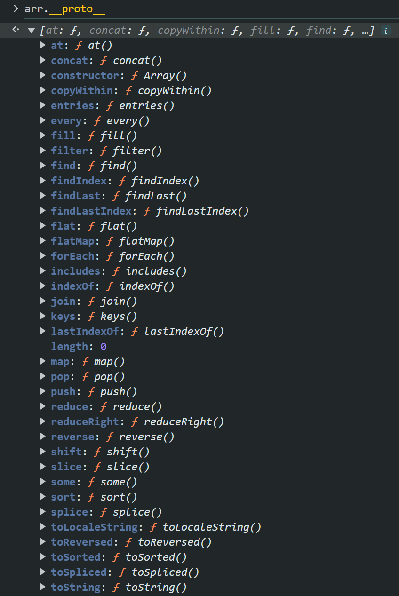
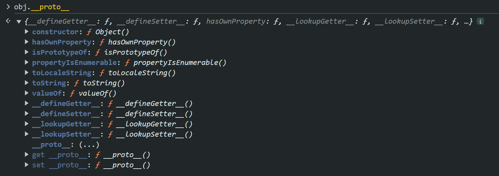
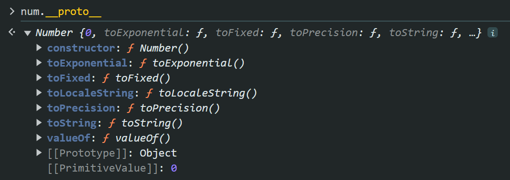

### Prototypal Inheritance
Each object is derived from the class "Object" as you now.

For example lets say we created an array : 
```js
const arr = []
```
and if we look up the methods this array object have :
```js
arr.__proto__
```
we can see that there are a lot of methods :



and lets also create an object object and look up its proto as well : 
```js
const obj = new Object()
``` 
```js
obj.__proto__
```
it has some methods as well:



and as you may notice the function of .toString() is defied in both proto. So which one is actually get called if I invoke this method in arr object for example:
```js
arr.toString()
```

now it is an important rule : "the most specific method will be called"

therefore the method defined in array object itself is more specific than the method defined in object class. Therefore when we invoke .torString() method on the arr object, the one that defined in array class will be invoked.


### primitive types has wrappers

as you know primitive types doesnt have a function.
for example this will raise an error: 
```js
42.toString()
```
but if we do that :
```js
const num = 42
num.toString()
//"42"
```
so the reason of that is js actually wrap the primitive type with an wrapper class. when you look its proto you can see that prototype class is a class named "Number"
```js
num.__proto__
```


but this is not the actual class of num object here, it is protoptype class of num object. so if you do that, you can see that it is not the object of Number class: 
```js
x instanceof Number
//false
```

but for example you can change the .toString() function behavior by : 
```js
Number.prototype.toString = function() {
   return "100"
}
```

now you can see that you num.toString() will output "100". 🫥
yea, this is the cons of inheritance, a wrong implementation will fuck up all your object you created loong time agoo maybe. So dont do this, it is only for educational purposes :)


