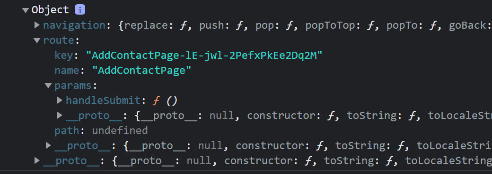
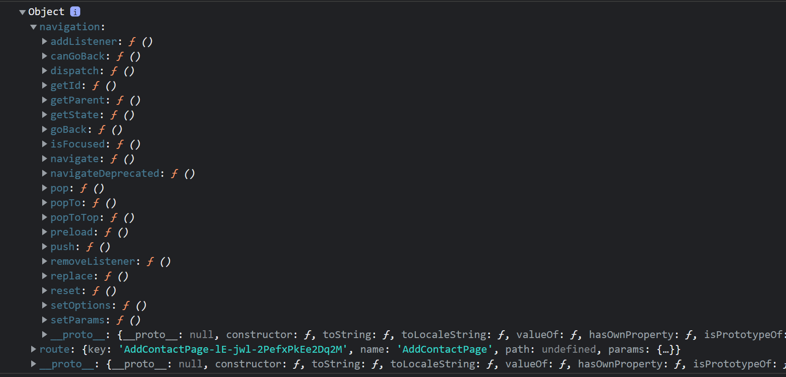

## What is React Native
A framework that relies on React core

In React Native, there are seperate threads for UI, layout and Javascript.
As you may remember from react web, since it is single threaded, when a js code blocks (infinite loop etc) UI (webpage) also freeze. It is not the case in RN and mobile dev.

Onenote photo

## Component Difference btw React Web and React Native

In react web, as you remember you can direcly use react web components (html like, lowecase starting tags) without any import. In react native components are not globally in scope. You need to import before using.

Like this:
```js
import {
  SafeAreaView,
  Button,
  ScrollView,
  StatusBar,
  StyleSheet,
  Text,
  Switch,
  useColorScheme,
  View,
} from 'react-native';
```

### div -> view

### span -> Text

### button -> Button
- onClick -> onPress
- no opening closing -> title: "ADD Todo"

### ul-li -> scrollview and view
there is no ul or li elements, you just put your list items probably in between view elements to scrollview


## Styling in React Native and diff with React Web

Both in react web (css) and react native, styling is based on `flexbox` layout. But the difference is, in react web, default flexbox layout is row, in react native it is column. 

It means, if you do not specify any flexbox direction (flexDirection) in your style, in react web, div will cumulate elements in a row, while view element in react native will cumulate them from up to down, as a column.


In react web, you add a classname and style it with css. But In React Native styling is being done with js objects.

like this (on View element):
```js
    <View style={{flexDirection :'row', alignItems:'center'}}>
      <Switch/>
      <Button onPress={()=>props.deleteCallback(props.id)} title="delete" />
      <Text>{props.name}</Text>
    </View>
```

as you may notice there is a bit of weird usage like this : {{}}.
the first {} is for : "hey, this is a js code
the second {} is to create a js object.
 
And this style objects are passed to UI thread every time. 
Therefore there is a more efficient and effective way of styling, using a StyleSheet:

```js
const styles = StyleSheet.create({
  todoContainer: {
    flexDirection: 'row',
    alignItems: 'center',
  },
  appContainer: {
    paddingTop: Constants.statusBarHeight,
  },
  fill: {
    flex: 1,
  }
})
```

and now you can use these as a styling object.

like this (style on View element):
```js
    <View style={styles.todoContainer}>
      <Switch/>
      <Button onPress={()=>props.deleteCallback(props.id)} title="delete" />
      <Text>{props.name}</Text>
    </View>
```

So that now, this style object is passed to ui thread once and hashed, so that you only pass integer value to apply specific style.

---
lettsay you need to apply more than one style to an element, in that case, you can pass a list of styles since style prop can take an array of styles.

like this :
```js
<View style={[styles.appContainer, styles.fill]}>
    <Text>Todo count: {this.state.todos.length}</Text>
    <Button onPress={() => this.addTodo()} title="Add TODO" />
</View>
```


### style components

#### marginTop, marginBotton...

onenote photo

#### flexDirection

onenote photo

#### AlignItems

onenote photo


#### fontSize
like this:

fonstSize:48


## Event Handling in React Native, and the diff with React Web
In web, every component has every interaction. You can add a onClick function to a div for example.

But in react native, there are only a few “touchable” components:
- Button
- TouchableOpacity, TouchableHighlight, TouchableWithoutFeedback 
- TouchableNativeFeedback (Android only)


## Adding keys to scroll element
Lets say we have a list that we will show it. But react want to know keys so that when a new item added or removed from list, dom will be updated with less number of moves (more efficient adding and removing).
Here how to assign key to item of a list:

```js
class App extends React.Component{

  render(){
    return (
      <View>
      <Button title="Toogle Contacts"/>
      <ScrollView>
        {contacts.map(contact => (
          <View>
            <Text key={props.key} >{props.name}</Text>
          </View>
        ))}
      </ScrollView>
      </View>
    )
  }
}

export default App;

```

örneğin burda list itemleri sadece isim olduğu için, key i direk Text componentine verdik. 
fakat eğer list itemimizde hem text hem de number olursa bu durumda bu iki bilgiyi içeren componenti bir View içine 
alıp bu view a key vermek gerekir.


### componentler capital letter ile başlamalı

```js
hatali -> <contactItem> 
dogru -> <ContactItem>
```

hatta küçük harfle component yapıp kullannmaya çalışırsan hata alıyorsun

### prop lar component isminden sonra verilir
```js
<Button title = "ismail">
veya
<ContactItem {...contact}>
```


### componente prop verme ve bunu component içinde bunu kullanma

component e parametre olarak verirken, tüm keyler ve valuelar ayrı ayrı olarak verilir
ardından bunlar props diye bir objede toplanıp componentin içinde bu keyler ayrı ayrı seçilerek kullanılır.


## why do we need to seperate components into different files
think about a large scale app that has 1000 components, is it convenient to put them
into 1 file?


## ScrollView vs FLatList

Scrollview tüm listeyi ekranda basılmasa bile oluşturur. ScrollView render all of its children before appearing.
bu yüzden örneğin contacts app yaparken 10000 kişilik bir listeyi render etmek çok uzun sürer.
Fakat FlatList sadece ekranda basılan kişileri DOM a ekler, ekran kaydırıldıkça DOM a yeni elemenalar eklenir ve çıkartılır.

ScrollView da key belirlemek zorunlu değildir, direk hepsini render eder, fakat yine de key vermek beneficial olur çünkü listedeki bir eleman updatelenir veya yeni bir eleman vs eklenirse, react render ağacını baştan yazmaktansa bu key i kullanarak sadece gereken yere ekleme yapar örneğin. bu yüzden key vermek performans sağlar.

Flatlist için ise key direk zorunludur.

ScrollViewda örnek key kullanımı : direk aslında listin item ı ne olacaksa ona key ne ise onu vermeli :

Bu örnekte hem isim hem de telefon numarası birlikte bir list item oluşturduğu için bu ikisini bir view a alıp key i bu view a verdik.
```js
render() {
  return (
    <View>
    <Button title="Toogle Contacts" onPress={this.toggleContact}/>
    <ScrollView>
    {contacts.map(contact => (
      <View key = {contact.key}>
        <Text>{contact.name}</Text>
        <Text>{contact.phone}</Text>
      </View>
    ))}
    </ScrollView>
    </View>
  )
}
```

Fakat diyelim ki list item i bir component yapmak istiyoruz : 

```js

function Row(props){
    return (
      <View key = {props.key}>
        <Text>{props.name}</Text>
        <Text>{props.phone}</Text>
      </View>
    )
}

...
  render(){
    if (this.state.showContacts) {
      return (
        <View>
        <Button title="Toogle Contacts" onPress={this.toggleContact}/>
        <ScrollView>
          {contacts.map(contact => <Row {...contact} />)}
        </ScrollView>
        </View>
      )
    }

```

Burda `...contact` ifadesi aslında `key=contact.key name=contact.name number=contact.number` yazmak ile aynı şey oluyor, bu sayede tüm keyleri direk passleyebiliyoruz prop olarak, teker teker yazmaya göre epey kolaylık sağlıyor. 

Bu üç kullanım da aynı şey : (ikincisi obj nin item keyinin valuesunu direk bir obje yapıyor onu passliyor) : 

```js
renderItem = obj => <Row {...obj.item} />
renderItem = ({item}) => <Row {...item} />
renderItem = obj => <Row {name = {obj.item.name} phone={obj.item.phone} key={obj.item.key}} />

```


Fakat burda başka bir problem var (warning). Burda bize react diyor ki, Row componentinde props.key nullldır bu değeri kullamazsın, illa kullanacaksan da farklı bir isimle passle.

Bunun sebebi react, keyi "key" olan propu component passlemez, onu optimizasyon için kendisi kullanır, yani burda Row componentine giden "key" değeri null olmuş olur. 
"The key prop is not passed as a prop to the Row component itself; it is purely for React's internal purposes."


### FlatList

We pass an array of data and renderItem function as props.
renderItem is function that is used to render data, parameter obj is an object which "item" key is the data.

Data is the arbitrary list of anything that is going to be used as data to the rendering list.

```js
render(){
  return (
    <View>
      <Button title="Toogle Contacts" onPress={this.toggleContact}/>
      <FlatList
          renderItem={obj => <Row {...obj.item} />}
          data={contacts}
      />
    </View>
  )
}
```

to even make this code better in terms of performance, we can define renderItem's function outside so that js engine wont recreate this function every time render() invokes:

```js

"in class.."

renderItem = obj => <Row {...obj.item} />

render(){
  return (
    <View>
      <Button title="Toogle Contacts" onPress={this.toggleContact}/>
      <FlatList
          renderItem={this.renderItem}
          data={contacts}
      />
    </View>
  )
}
```

What about key in FlatList, as we said, it is mandatory to give keys to FlatList :
- if your data has already include a key called "key" FlatList aumotatically extract and uses it.
- if your data doesnt include a key called "key", you need to use a keyExtractor function on FlatList


## Ternary operating kullanımı

Örneğin contacts uygulamamızda tuşa bastığımızda contactları kapatıp açalım istiyoruz, yani gösterelim veya göstermeyelim. bunu state te tuttuğumuz bir değişkenin değerine göre if else ile yapabiliriz : 

```js
render(){

  if (this.state.showContacts) {
    return (
      <View>
      <Button title="Toogle Contacts" onPress={this.toggleContact}/>
      <FlatList
        renderItem={this.renderItem}
        data={contacts}
      />
      </View>
    )
  }

  else {
    return (
      <View>
        <Button title="Toogle Contacts" onPress={this.toggleContact}/>
      </View>
    )
  }

}
```

fakat bu kodda repetitiona sebep olduğu için daha okunaksız hale getiriyor. onun yerine aynı şeyi ternary operation ile yapabiliriz :

```js
  render(){
    return (
      <View>
      <Button title="Toogle Contacts" onPress={this.toggleContact}/>
      {this.state.showContacts ? (
        <FlatList
        renderItem={this.renderItem}
        data={contacts}
        /> 
        ) : null 
      }
      </View>
    )
  }
```

hatta burda daha temiz bir syntax için && operatorunu kullanabiliriz, bu operator kendinden önceki kısım truthy value ise, sonraki kısmı döndürür, değil ise null döndürür :

```js
  render(){
    return (
      <View>
      <Button title="Toogle Contacts" onPress={this.toggleContact}/>
      {this.state.showContacts &&
        <FlatList
        renderItem={this.renderItem}
        data={contacts}
        />  
      }
      </View>
    )
  }
```

## SectionList Kullanimi

SectionList in aldığı proplar:
- sections : list of section which is an object consist of header and data corresponing to it
- renderItem : same with flatlist, responsible for renderingan item
- renderSectionHeader : responsible for rendering header

```js
renderItem = obj => <Row {...obj.item} />;
renderSectionHeader = obj => <Text>{obj.section.title}</Text>


render(){
  return (
    <View>
      <Button title="Toogle Contacts" onPress={this.toggleContact}/>
      {this.state.showContacts &&
        <SectionList
          renderItem={this.renderItem}
          renderSectionHeader={this.renderSectionHeader}
          sections={[{
            title : "A",
            data : contacts,
          }]}
        />  
      }
    </View>
  )
}
```

## Why prevState is needed?

diyelim ki halihazırda state de bulunan bir değişkeni updatelemek istiyoruz. Bunu iki şekilde yapabiliriz : 

```js
  toggleContact = () => {
    1.kullanım -> this.setState({showContacts: !this.state.showContacts})
    
    2.kullanım -> this.setState(prevState => ({showContacts: !prevState.showContacts}))
  }
```
  
  burda tercih edilmesi gereken prevState kullanımıdır. çünkü diğer kullanımda şöyle sıkıntılar olabilir : 
  setstate async olduğundan örneğin bu fonksiyonu (toggleContact) 2 defa üst üste çağırdığımızda, True olan showContacts değişkeninin tekrar True olmasını bekleriz. fakat bu async call sırayla bu değişkene okuma  ve sırayla yazma yaparlarsa bu değişken False olur.


  ## React merges states when setState is invoked
  setstate yapıp yeni bir state return ettiğimizde react bunu direk gidip yeni state yapmaz, eski state ile merge eder.

  toggle kullanımı bu sayede çalışır. 

  ### Toggle kullanımı : 
  örneğin initial state imiz bu olsun : 
  ```js
  this.state = {
    isLoading: false,
    data: [1, 2, 3],
    error: null
  };
  ```
  ardından isLoading in durumunu true yapmak istiyoruz:

  bunu şöyle yapabiliriz:
  ```js
  this.setState((prevState)=>{...prevState, isLoading:true})
  ```
  fakat illa setState den döndüreceğimiz yeni objenin tüm state keylerini ve valularını içermesine gerek yoktur. sadece değiştirmek istediğimiz değeri değiştirip bunu döndürebiliriz.

  yani daha temiz ve kolay yazımı şu şekilde olur:

  ```js
  this.setState({ isLoading:true });
  ```
  bunun çalışmasının sebebi, react ztn bunu eski state ile mergelerken diğer keyleri eklemiş olacak.


---

şu kullanımın bir numarası yok : 
```js
this.setState(()=>({isLoading:true}))
```

yine react bundan dönen değeri {isLoading:true} alıp mevcut state ile mergeleyecek.


## Component Life Cycle

### componentDidUpdate()
bazen bunda state update ettiğimizde, bu da tekrar önce render ve sonra componentDidUpdate çağırdığından
sonsuz call stack hatası alırız. Bunu engellemek için componentDidUpdate içinde prevstate ile şuanki state aynı mı 
farklı mı kontrolü yapabiliriz:

```js

  componentDidUpdate(prevProps, prevState){
    if (prevState.name !== this.state.name || prevState.phone !== this.state.phone) {
      -> en son state'i biz değiştirdiğimiz için gerçekleşen update
    }
    else{
      -> state ler aynı
    }
  }
```


## KeyboardAvoidingView

Bazen ekrandaki şeyler çok olduğunda, klavyeyi açtığımızda klavye yazmak istediğimiz text_input componentini kapatabilir.
Bunun önüne geçmek için, Bu text inputları içeren büyük view yerine keyboardavoidingview kullanırız. 
Bunun aldığı bir parametre vardır : `behaviour`, ve verilebilecek 3 değer vardır:

padding: Adjusts the bottom padding of the view to avoid the keyboard.
position: Directly changes the position of the KeyboardAvoidingView.
height: Reduces the height of the view to prevent overlapping.

The best method here is to try all of them and look which one works best for your case.

before : 
```js
<View>
  <TextInput
    style = {styles.input}
    placeholder="Name"
    value = {this.state.name}
    onChangeText={this.onChangeName}
  />
  <TextInput
    style = {styles.input}
    placeholder='Number'
    value = {this.state.phone}
    onChangeText={this.onChangeNumber}
    keyboardType='numeric'
  />
  <Button 
    style = {styles.button}
    title = "Submit" 
    disabled = {!this.state.isFormValid}
    onPress={()=>{this.props.handleSubmit(this.state)}}
    />
</View>
```

after :
```js
<KeyboardAvoidingView behavior="padding" style={styles.container}>
  <TextInput
    style={styles.input}
    value={this.state.name}
    onChangeText={this.getHandler('name')}
    placeholder="Name"
  />
  <TextInput
    keyboardType="numeric"
    style={styles.input}
    value={this.state.phone}
    onChangeText={this.getHandler('phone')}
    placeholder="Phone"
  />
  <Button title="Submit" onPress={this.handleSubmit} disabled={!this.state.isFormValid} />
</KeyboardAvoidingView>
```


## Error and Warnings

nasıl ki console.log() yapabiliyorsak, console.error() ve console.warning() de yapabiliriz.
Bunlar full page error ve warning verir.

## Navigation

There is no one way of navigation. React Native originally included a built-in navigation API, but it was eventually removed, in favor of a semi-official library called react-navigation.

react-navigation'ın kendine ait bir webpage'i olmasının da sebebi bu.

There are a few aspects of navigation which make it challenging in React Native: 

  - Navigation works differently on each native platform. iOS uses view controllers, while android uses activities. These platform-specific APIs work differently technically and appear differently to the user. React Native navigation libraries try to support the look-and-feel of each platform, while still providing a single consistent JavaScript API.
  - Native navigation APIs don't correspond with "views". React Native components like View, Text, and Image, roughly map to an underlying native "view", but there isn't really an equivalent for some of the navigation APIs. There isn't always a clear way to expose these APIs to JavaScript.
  - Navigation on mobile is stateful. On the web, navigation is typically stateless, where a url (i.e. route) takes a user to a single screen/page. On mobile, the history of the user's navigation state is persisted in the application so that the user can go back to previous screens - a stack of screens can even include the same screen multiple times.

Due to these challenges, there isn't a single best way to implement navigation, so it was removed from the core React Native package.

Expo also has its own navigation solution. But I use react-navigation.

In react navigation, navigation container includes navigator and navigator itself points to some screen. navigation happens btw those screens connected to navigator.

### we can pass some object to the screen we are navigation to : 
```js
<Button 
  title="Add New Contact" 
  onPress={() => this.props.navigation.push('AddContactPage', { handleSubmit: this.handleSubmit })}
/>
```

in the AddContactPage screen, this object come inside route object's params inside the props.
Have a look at the props of AddContactPage when navigated :


so we access it throught :
`this.props.route.params.handleSubmit()`

dolayısıyla her bunu kullanmak istediğimizde bu kadar uzun yazmamak için, contructorda bunu bir field a verebiliriz : 

```js
class AddContactPage extends React.Component {
    constructor(props) {
        super(props);
        this.state = {
            // your state initialization
        };
        this.handleSubmit = this.props.navigation.getParam('handleSubmit', () => {});
    }
```

### how to go back : 


We can use goBack() function:
```js
this.props.navigation.goBack()
```


## arrow function 

Lets look at those 3 examples :

First :
```js
<Button 
  title="Add New Contact" 
  onPress={() => this.props.navigation.push('AddContactPage', { handleSubmit: this.handleSubmit })}
/>
```

Second :
```js
<Button 
  title="Add New Contact" 
  onPress={() => { 
    this.props.navigation.push('AddContactPage', { handleSubmit: this.handleSubmit }) 
  }}
/>
```

Third :
```js
<Button 
  title="Add New Contact" 
  onPress={this.props.navigation.push('AddContactPage', { handleSubmit: this.handleSubmit })}
/>

```


First and second are not immediately invoked when button is being rendered. But the third one  would immediately invoke this.navigation.push when the component (button) renders, rather than when the button is pressed. This is not the behavior you want.

But what is the diff btw first and second:
First and second creates two functions. but when you dont use {} after =>, it will directly return it (but since before returning, the it is being evaluated means invoked, it will still be invoked.). But second one doesnt return anything out of that function (if there is no return statement as in our example) it just invoke it.

So for our example which one we should use? First one is best in that case since it is simpler than second.

