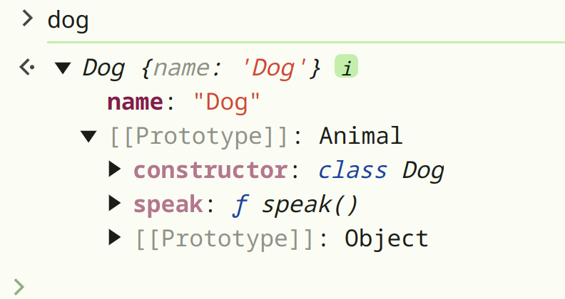

### Prototypal Inheritance
Each object is derived from the class "Object" as you now.

For example lets say we created an array : 
```js
const arr = []
```
and if we look up the methods this array object have :
```js
arr.__proto__
```
we can see that there are a lot of methods :


and lets also create an object object and look up its proto as well : 
```js
const obj = new Object()
``` 
```js
obj.__proto__
```
it has some methods as well:


and as you may notice the function of .toString() is defied in both proto. So which one is actually get called if I invoke this method in arr object for example:
```js
arr.toString()
```

now it is an important rule : "the most specific method will be called"

therefore the method defined in array object itself is more specific than the method defined in object class. Therefore when we invoke .torString() method on the arr object, the one that defined in array class will be invoked.


### primitive types has wrappers

as you know primitive types doesnt have a function.
for example this will raise an error: 
```js
42.toString()
```
but if we do that :
```js
const num = 42
num.toString()
//"42"
```
so the reason of that is js actually wrap the primitive type with an wrapper class. when you look its proto you can see that prototype class is a class named "Number"
```js
num.__proto__
```


but this is not the actual class of num object here, it is protoptype class of num object. so if you do that, you can see that it is not the object of Number class: 
```js
x instanceof Number
//false
```

but for example you can change the .toString() function behavior by : 
```js
Number.prototype.toString = function() {
   return "100"
}
```

now you can see that you num.toString() will output "100". 🫥
yea, this is the cons of inheritance, a wrong implementation will fuck up all your object you created loong time agoo maybe. So dont do this, it is only for educational purposes :)

---

In js, classes are just syntactic sugar for protoptypical inheritance.

Every object has a prototype. (means derived from a class)

inheritance bu protoptypelar sayesinde sağlanır.

örneğin şu kod : 
```js
class Animal {
    constructor(name) {
        this.name = name;
    }
    speak() {
        console.log(`${this.name} makes a sound`);
    }
}

class Dog extends Animal {
    speak() {
        console.log(`${this.name} barks`);
    }
}

const dog = new Dog("myDog");
dog.speak(); // Dog barks
```
örneğin bu kod sonrasında dog objesine bakarsak şunu görürüz :



fakat aynı kodu direk class keywordunu kullanmadan şu şekilde de yazabiliriz :

```js
let Animal = {
name : null,
speak : function () {
        console.log(`${this.name} makes a sound`);
    }
};

let Dog = {
    __proto__ : Animal,
    name : "myDog"
}
```


Not : bu örnekte Dog.bark() yapıldığında neden "myDog makes a sound" yazdığını 
fakat "null makes a sound" yazdığını "this" classında işledik. not: cevap "Property Resolution in the Prototype Chain"


hatta aynı kodu object constructor kullanarak da yazabiliriz :

```js
let Animal = {
name : null,
speak : function () {
        console.log(`${this.name} makes a sound`);
    }
};


function Dog(name){
this.name = name;
this.__proto__ = Animal;
}
```
ardından bir obje oluşturup speak fonksiyonunu invoke edebiliriz:

```
const myDog = new Dog("myDog");
myDog.speak();
> myDog makes a sound
```


---

yukarda gördüğümüz farklı şekillerde obje oluşturabiliriz ve bir şekilde inheritance ı kullanabiliriz.

peki bu 3 yöntemle ilgili shared method meselesine bakalım :

yukardaki örneklerde speak fonksiyonu direk prototype da olduğu için zaten her örnekte shared method olayı mevcuttu. yani yeni bir dog objesi oluşturduğumuzda aynı speak fonkiyonu tüm dog objelerinden ulaşılabiliyordu. 

speak methodu direk oluşturduğumuz objede olsaydı, bu methodun shared olup olmadığı durumu nasıl olacaktı : 

Kısa özet tablo şu şekilde : 

| Type               | Prototype Accessor   | shared methods |
|--------------------|---------------------|------------------|
| Object Literal    | Object.prototype    | No              |
| Constructor Function | Constructor.prototype | No         |
| Class             | Class.prototype     | Yes             |


burdaki object literal dediğimiz, hem bizim objeyi hem de parent classı obje olarak yazdığımı örnek oluyor.

constuctor function ve class ise isminden belli olan diğer örnekler.

şimdi bazı ufak cod snippetleriyle bunun gerçekten böyle olduğunu gösterelelim : 


object literal olarak obje oluşturduğumuzda zaten shared method olmadığı bariz ortada : 
```js
let Animal = {
   name : null,
   speak : function () {
         console.log(`${this.name} makes a sound`);
      }
};

let Dog = {
    __proto__ : Animal,
    name : "myDog"
    bark : function () {
        console.log(`${this.name} barked`);
    }
}

let Dog2 = {
    __proto__ : Animal,
    name : "myDog"
    bark : function () {
        console.log(`${this.name} barked`);
    }
}

console.log(Dog.bark === Dog2.bark)
> False
```


bu da constuctor function örneği : aynı constructor function ile yaratılmasına rağmen aynı fonksiyonlara bakmıyorlar dog objeleri.

```js
function Dog(name) {
    this.name = name;
    this.bark = function() {
        console.log(this.name + " barked");
    };
}

const dog1 = new Dog("James");
const dog2 = new Dog("Max");

console.log(dog1.bark === dog2.bark); // false (different function instances)
```

fakat eğer istersek constructor function kullanarak da shared method u direk Dog objesinin prototypeına  explicity bağlayarak şu şekilde gerçekleştirebiliriz : 

```js
function Dog(name) {
    this.name = name;
}

// Define `bark` on the prototype (shared among instances)
Dog.prototype.bark = function() {
    console.log(this.name + " barked");
};

const dog1 = new Dog("James");
const dog2 = new Dog("Max");

console.log(dog1.bark === dog2.bark); // true (same function reference)
```

class kullandığımızda ise classdaki tüm propertyler ve methodlar direk prototypeın içinde oluşturulur, bu yüzden shared method otomatik olarak mevcut olur. 

```js
class Dog {
    constructor(name) {
        this.name = name;
    }

    bark() {
        console.log(this.name + " barked");
    }
}

const dog1 = new Dog("James");
const dog2 = new Dog("Max");

console.log(dog1.bark === dog2.bark); // true (shared method)
```


