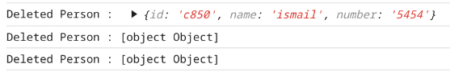

## Anti-pattern: Array Indexes as Keys

react da bir liste vs oluşturacağımız zaman listenin her bir elementine key vermemiz gerekir.
eğer vermezsek react agabey kendisi en azından array ın indexlerini verir.
fakat bu robust bir yöntem değil, çünkü react virtual dom ile normal domu karşılaştırıken bu keylere bakarak karşılaştırır.
yani mesela listedeki 4.indexteki elemanı çıkarıp sonra bir şey ekledin diyelim, hala 4.indexte bir eleman olduğu için ve toplamda 
listedeki eleman sayısı değişmediği için bu bir update olaark algılanmaz ve dom updatelenmez.

bunun için en iyi yol, id leri kendimiz vermek. bunu az sayıda eleman varsa her elemana idyi elle vererek yapabiliriz.
veya glboal bir değişken tuutp onu incerment ederrek yaabiliriz.
veya shortid import edip onu kullanabilriiz, aynı mantık sadece global pollution yapmamış oluruz.

Yapılmaması gereken : 
```js
{
  todos.map((todo, index) => <Todo {...todo} key={index} />);
}

```

Bu iyi :
```js
todoCounter = 1;

function createNewTodo(text) {
  return {
    completed: false,
    id: todoCounter++,
    text,
  };
}

```

Bu daha iyi :

```js
var shortid = require("shortid");

function createNewTodo(text) {
  return {
    completed: false,
    id: shortid.generate(),
    text,
  };
}

```


Sources :
```
https://robinpokorny.com/blog/index-as-a-key-is-an-anti-pattern/
https://fullstackopen.com/en/part2/rendering_a_collection_modules#anti-pattern-array-indexes-as-keys
```

## it is okay to keys on the sub custom items

örneğin Note componentimiz var diyelim ve bir de notes arrayimiz var,
bu notes arrayimizdeki notları Notes a passleyip, render edeceğiz diyelim.

Burda note lar bir <ul> altında olacağı için notelarrın hepsinin bir id si olmalı, fakat bu id ler
illa <il> de olmak zournda değil bu notta anlatmak istediğimiz bu. ul in altnda hangi component varsa ona passlenmesi yeterli.

örneğin şuna bakabilirsiniz : 

```js
const Note = ({ note }) => {
  return (
    <li>{note.content}</li>
  ) 
}

const App = ({ notes }) => {
  return (
    <div>
      <h1>Notes</h1>
      <ul>

        {notes.map(note => 
          <Note key={note.id} note={note} />
        )}
      </ul>
    </div>
  )
}
```


## react styling


Örneğin p yi şu şekillerde boldlayabiliriz :


```js
const Content = ({parts})=>{
  return(
    <div>
        {parts.map((part) => <Part part={part} key={part.id}/>)}
        <p style={{ fontWeight: 'bold' }}>
          total of {parts.reduce((acc,item)=>acc+item.exercises, 0)} exercises
        </p>
    </div>
  )
}
```

```js
// In your CSS file
.bold-text {
  font-weight: bold;
}

// In your Component
const Content = ({parts})=>{
  return(
    <div>
        {parts.map((part) => <Part part={part} key={part.id}/>)}
        <p className="bold-text">
          total of {parts.reduce((acc,item)=>acc+item.exercises, 0)} exercises
        </p>
    </div>
  )
}
```

## dont use + for string concatenation

using the + operator for string concatenation in JavaScript/React is generally considered less ideal since it can lead to unexpected type coercion.

use template literals instead


## use console.log("props", prop)

using this :
```js
console.log("props" + props)
```
gives not explanatory descrption.


therefore use this :
```js
console.log("props", props)
```


## naming conventions 

In JavaScript/React applications:
- Use **camelCase** for:
  - Files containing regular functions/modules
  - Variables
  - Functions
- Use **PascalCase** for:
  - React components
  - Class names


  ## REST
  In REST terminology, we refer to individual data objects, such as the notes in our application, as resources. Every resource has a unique address associated with it - its URL. The notes URL, on the other hand, would point to a resource collection containing all the notes.

  Common HTTP methods and their typical uses in a REST API:

  GET /api/persons - Get all persons
  GET /api/persons/:id - Get a single person
  POST /api/persons - Create a new person
  PUT /api/persons/:id - Update a person
  DELETE /api/persons/:id - Delete a person


  ## printing objects in console

  Lets say we deleted a person and want to inform user
  which person object is deleted. therefore we want to print deleted person Object to the console : 

  so we have 3 options :

  ```js
  console.log("Deleted Person : ", deletedPerson);
  console.log("Deleted Person : " + deletedPerson);
  console.log(`Deleted Person : ${deletedPerson}`);
  ```

  Only  one of them is logs a real informative message : 

  


  Therefore use first option, seperating with comma.


  Or you can do this as well althout not recommended since we dont really know what is this object when we only look console :

  ```js
  console.log(deletedItem);
  // {id: '52a7', name: 'feafa', number: '343'}
  ```

## window.confirm()

https://developer.mozilla.org/en-US/docs/Web/API/Window/confirm


şu şekilde kullanılır : 

```js
const shouldUpdate = window.confirm(`${currentPerson.name} is already added to phonebook, replace the old number with the new one?`);

```

çıkan kutuda kullanıcı "ok" a basarsa, shouldUpdate true olur, "cancel" a basarsa false olur.


## useRef

bazen componentimizin içinde bir değeri tutmak isteriz fakat bu değeri her render de kaybetmek istemeyiz, fakat bu değer updatelendiğinde render etmek de istemeyiz veya bu değer zaten initialization haricinde updatelennmeyecektir, bu durumda state var yapmak istemiyoruz çünkü overkill, normal değişken yaparsak da bu değeri her render da kaybedeceğiz. global değişken de koymak istemiyoruz.

bu yüzden useRef hook kullanırız, çünkü : 

It persists between renders
It's more "React-like" than module-level variables
It doesn't trigger re-renders when changed
It keeps the data scoped to the component
It's cleaner than using global variables


```js
import { useRef, useEffect, useState } from 'react'

function App() {
  const [filter, setFilter] = useState("");
  const countriesRef = useRef([]);
  
  useEffect(() => {
    countryService
      .getAll()
      .then((countries) => {
        countriesRef.current = countries;
      });
  }, []);

  return (
    <div>
      find counties <input type="text" value={filter} onChange={onFilterChange} />
      <CountryCatalog allCountriesList={countriesRef.current} filter={filter} />
    </div>
  );
}
```